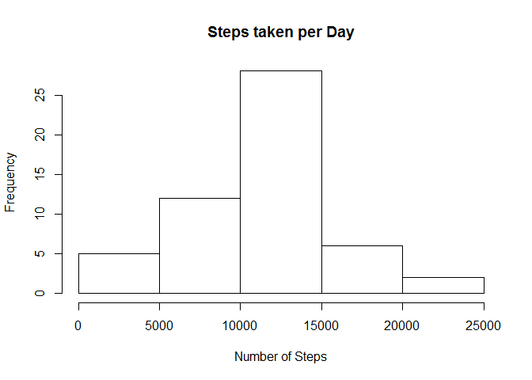
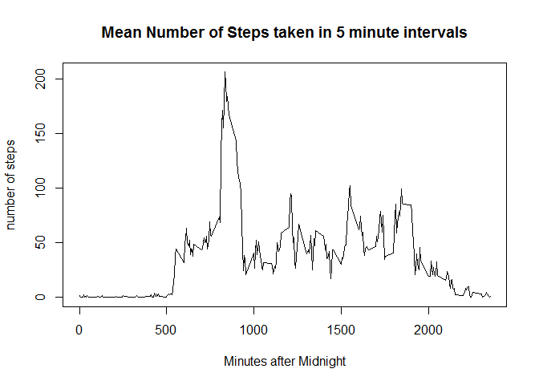
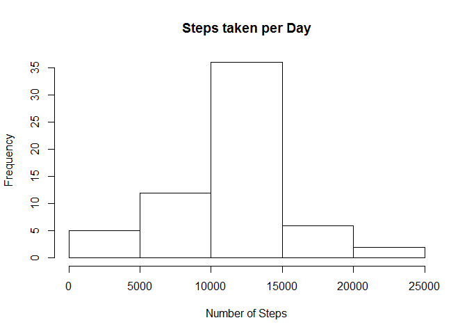
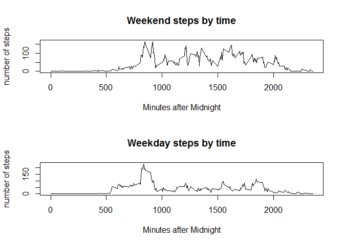

# Reproducible Research: Peer Assessment 1
For this project I was asked to download, process and analyze a dataset which consisted of the number of steps taken by an individual in 5 minute intervals over a period of 2 months. I began by downloading the zip file to a local directory on my computer and then unzipping and reding the "activity.csv" file into R.

```r
setwd("C:/Coursera/Reproducible Research")
#fileURL <- "https://d396qusza40orc.cloudfront.net/repdata%2Fdata%2Factivity.zip"
#download.file(fileURL,
#              "C:/Coursera/Reproducible Research/Peer Assessment 1 Data.zip")
datna <- read.csv(unz("Peer Assessment 1 data.zip", "activity.csv"))
```
To better understand the data I omitted the missing values and then grouped the number of steps into full days rather than 5 minute intervals.  

```r
dat <- na.omit(datna)
dat.day <- aggregate(steps~date,dat,sum)
```
I then did some exploratory analysis by creating a histogram of the number of steps taken each day and calculating the mean and median of the number of steps taken each day.

```r
hist(dat.day$steps,main="Steps taken per Day",xlab="Number of Steps")
```

 

```r
mean(dat.day$steps)
```

```
## [1] 10766.19
```

```r
median(dat.day$steps)
```

```
## [1] 10765
```
Another way of looking at the data is to consider each day as a seperate trial and find the average number of steps taken at different times of the day over the 2 month period.  

```r
dat.time <- aggregate(steps~interval,dat,mean)
plot(dat.time$interval,dat.time$steps,
     type="l",
     main="Mean Number of Steps taken in 5 minute intervals",
     xlab="Minutes after Midnight",
     ylab="number of steps")
```

 

```r
minutes <- dat.time[dat.time$steps==max(dat.time$steps),]$interval
```
This shows that the 5 minute interval from 835 to 840 minutes after midnight has the most steps taken.  This corresponds to 1:55 to 2:00 pm.  
If we wanted to replace missing values with a reasonable estimate I would replace the missing 5 minute interval with the mean value for that 5 minute interval for times we do have.  The same exploratory data analysis was preformed for the new data set.

```r
dat.replaced <- datna
for (i in 1:nrow(dat.replaced)){
    if (is.na(dat.replaced[i,1])==TRUE){
      dat.replaced[i,1] <- dat.time[dat.time$interval==dat.replaced[i,3],2]
    }
}
dat.replaced.day <- aggregate(steps~date,dat.replaced,sum)
hist(dat.replaced.day$steps,main="Steps taken per Day",xlab="Number of Steps")
```

 

```r
mean(dat.replaced.day$steps)
```

```
## [1] 10766.19
```

```r
median(dat.replaced.day$steps)
```

```
## [1] 10766.19
```
By replacing the missing values with the average from that interval we find that the number of counts of each histogram bin increases.  This makes sense because we are only adding data.  The median increases marginally which suggests that more intervals were missing from later times than earlier times and that the new middle number was a missing value because if we had only integers we would not get a decimal more complpicated than 0.5 otherwise.  The mean remains unchanged which tells us that the missing values were evenly distributed arounf the origional mean.  
We could ask the question, "is there a difference between weekdays and weekendsin the number of steps?"  To answer this question we create a new field which will tell us if the day is a weekday or a weekend.

```r
dat.replaced$day.of.week <- as.character(weekdays(as.Date(dat.replaced$date)))
for(i in 1 : nrow(dat.replaced)){
  if( dat.replaced$day.of.week[i]=="Saturday"){
    dat.replaced$day.type[i] <- "weekend"
  }
  else if(dat.replaced$day.of.week[i]=="Sunday"){
    dat.replaced$day.type[i] <- "weekend"
  }
  else{
    dat.replaced$day.type[i] <- "weekday"
  }
}
dat.replaced$day.type <- as.factor(dat.replaced$day.type)
dat.weekend <- dat.replaced[dat.replaced$day.type=="weekend",]
dat.weekday <- dat.replaced[dat.replaced$day.type=="weekday",]
par(mfcol=c(2,1))
dat.weekend.interval <- aggregate(steps~interval,dat.weekend,mean)
dat.weekday.interval <- aggregate(steps~interval,dat.weekday,mean)
plot(dat.weekend.interval$interval,
     dat.weekend.interval$steps,
     main="Weekend steps by time",
     xlab="Minutes after Midnight",
     ylab="number of steps",
     type="l")
plot(dat.weekday.interval$interval,
     dat.weekday.interval$steps,
     main="Weekday steps by time",
     xlab="Minutes after Midnight",
     ylab="number of steps",
     type="l")
```

 

The two plots show a clear difference in the average number of steps throughout the day on weekends and weekdays.  On weekends the number of stepsis fairly uniformly distributed among waking hours; however, on weekdays there is a clear peak at around 2 pm when the subject is most active.
